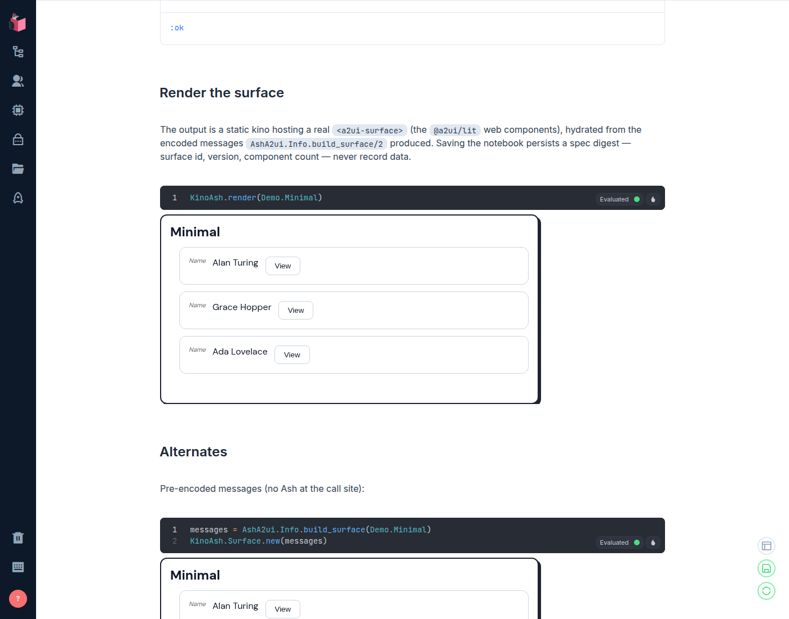
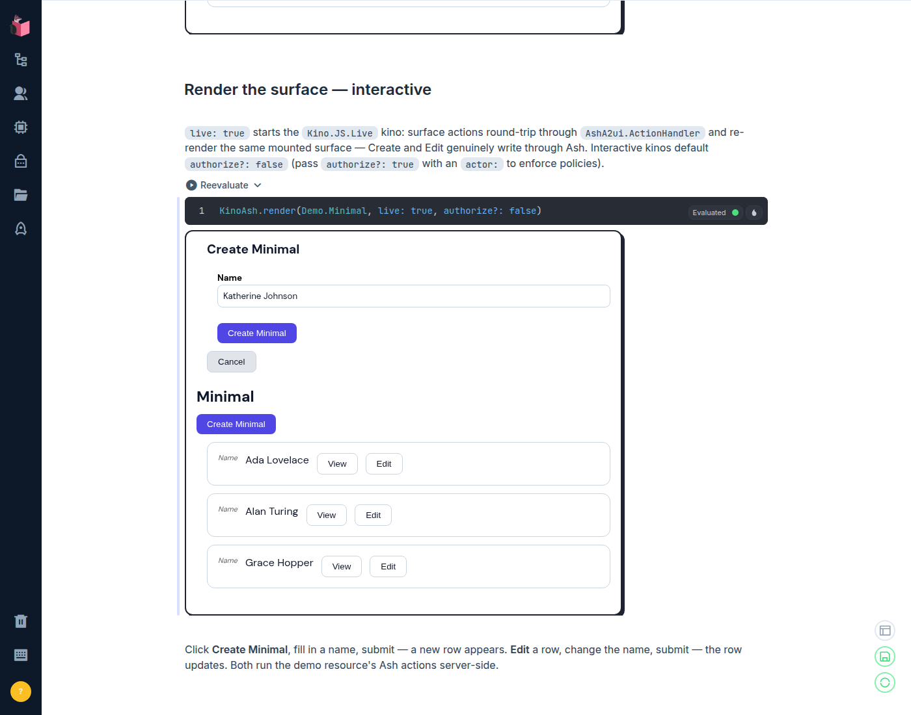
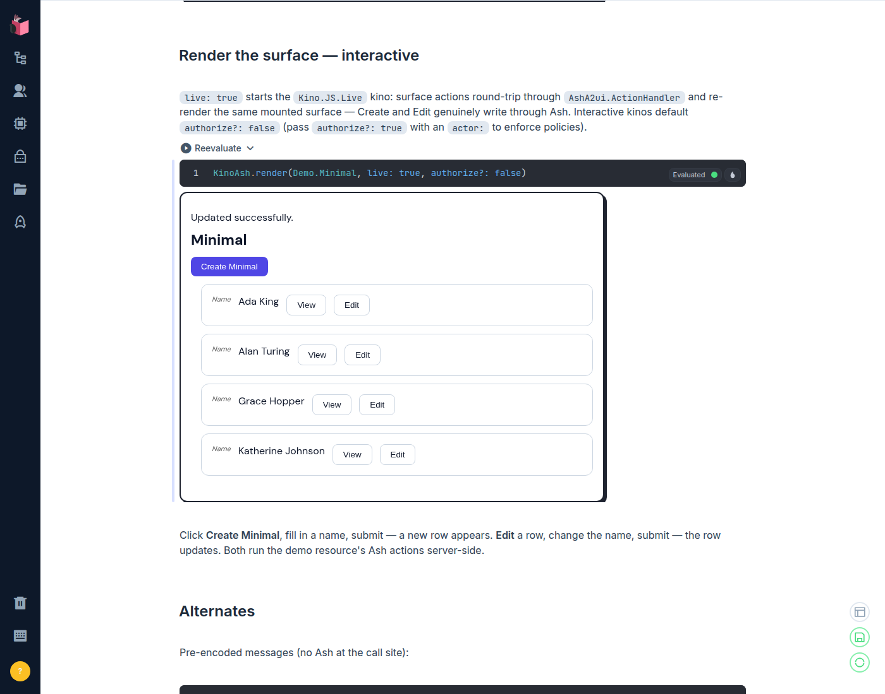

# kino_ash

Kino/Livebook widgets for the Ash ecosystem: render a real
[A2UI](https://a2ui.org) surface — table, forms, empty states — from an Ash
resource, using the `@a2ui/lit` web components and the same encoder
`ash_a2ui` uses in Phoenix LiveView apps.

```elixir
KinoAsh.render(MyApp.Support.Ticket)
```

## Status: demo slice (S2 + I1 + I2)

This is the verified demo slice, not the full package:

- **S2 bundle spike** — a standalone-HTML esbuild bundle proving
  `@a2ui/lit` 0.11 renders a real surface in a plain iframe from
  ash_a2ui's encoded messages (playwright-verified headless: controls in
  shadow DOM, zero `[object Object]`). Its boot path is exactly what the
  shipped kino asset runs.
- **I1 package skeleton** — the static `KinoAsh.Surface` kino plus the
  `KinoAsh.render/2` convenience, with the esbuild output committed under
  `lib/assets/a2ui_surface/build/` (kino convention).
- **I2 interactive tier** — `KinoAsh.Interactive`, a `Kino.JS.Live` kino:
  surface actions round-trip through `AshA2ui.ActionHandler` and the same
  mounted surface re-renders. Create and Edit genuinely write through Ash
  inside the notebook.

## API

```elixir
# Ash-aware: resolves the surface via AshA2ui.Info.build_surface/2
KinoAsh.render(MyApp.Support.Ticket, actor: actor)

# Standalone UI module (AshA2ui.Standalone)
KinoAsh.render(MyApp.UI.TicketUI)

# Interactive: actions run server-side and the surface re-renders
KinoAsh.render(MyApp.Support.Ticket, live: true, actor: current_user)

# Lower level: pre-encoded messages — the same server->client payload the
# ash_a2ui JS hook consumes (string or atom keys; at least one createSurface)
KinoAsh.Surface.new(messages)

# ... or a builder MFA the notebook supplies
KinoAsh.Surface.new({MyApp.UI, :build_surface, [actor: actor]})

# export: false skips the .livemd spec digest on save
KinoAsh.render(MyApp.Support.Ticket, export: false)
```

`export: true` (the default) persists a **spec digest** — surface id,
catalog id, protocol version, component count, message kinds — never
record data, because kino assets are served unauthenticated.

## Interactive surfaces

`live: true` starts `KinoAsh.Interactive` (`Kino.JS.Live`): the client
forwards the vendored hook's `a2ui:action` pushes, the kino server runs
them through `AshA2ui.ActionHandler.handle/3` — actor-aware, allowlist-
enforced — and broadcasts the follow-up `updateDataModel` messages back
as `a2ui:messages`; the same mounted surface re-renders. No asset
changes beyond a backwards-compatible live branch in the boot: the
static kino is untouched, and the vendored hook is shared.

**The actor contract** — the one place the static kino's host-agnostic
contract gains a server-side opinion: `:actor` and `:tenant` drive the
initial read and every dispatched action, and `:authorize?` defaults to
**false** (notebooks are a developer context). Pass `authorize?: true`
with an `actor:` to enforce policies on the read and on every action —
the server is the authority regardless of what the client renders:
non-allowlisted or policy-blocked actions are rejected with a
`/ui/status` error before touching Ash.

Exported interactive kinos persist their digest under the distinct
`a2ui_surface_live` info string with `"interactive" => true`, so a saved
notebook distinguishes action-carrying outputs from read-only ones.

## Verified in a real Livebook

`notebooks/demo.livemd` is executed headlessly in a real Livebook
(docker, playwright-driven) on every slice: all six cells evaluate, and
the render cell's output is a hydrated A2UI surface — the
`data-a2ui-hydrated` marker set (pierce the shadow DOM to see it), the
seeded records visible as rows with View/Edit controls plus the create
affordance, no `[object Object]` anywhere, zero console errors. The demo
surface declares a table *and* a form component: since the ash_a2ui
interaction-model change, row View/Edit affordances are emitted only
when a form target exists, so a table-only surface would render rows
without controls.



Two notebook-vs-package notes the real run surfaced (both fixed in the
demo): notebooks have no `config/config.exs`, so the demo sets Ash's
`default_string_length_count` itself before defining the resource; and
the demo depends on `kino_ash` from GitHub, matching what a public
consumer runs.

The interactive cell is verified the same way — playwright drives the
kino inside its output iframe: the create panel opens, a filled form
submits (`submit_form` over `a2ui:action`), the new row appears, and
typed success feedback renders; editing a row updates it in place.





The real run also pinned a demo-resource rule: the fixture's ETS table
must be shared (`private? false`), because actions execute in the kino's
server process — a private table would hide seed rows from action
refreshes and kino writes from other cells.

## Dependencies

`ash_a2ui` comes in as a git dependency pinned to the exact tree the
vendored hook and committed bundle were verified against. Bump the ref
deliberately — and re-vendor `assets/a2ui_surface/vendor/` from
ash_a2ui's `priv/js` when you do, so the server encoder and client hook
stay a matched pair.

## Rebuilding the JS bundle

```sh
cd assets/a2ui_surface
npm install
npm run build   # -> ../../lib/assets/a2ui_surface/build/{main.js,main.css}
```

The output is committed; consumers never need node.

## Headless verification

```sh
docker run --rm --network host -u $(id -u):$(id -g) -e HOME=/tmp \
  -e MIX_HOME=/m -v mixhome:/m -v hexcache:/tmp/.cache \
  -v ~/ast-forks/kino_ash:/w \
  -w /w elixir:1.18.4-otp-27 \
  bash -c 'set -o pipefail; MIX_ENV=test mix deps.get && MIX_ENV=test mix test'
```

`test/kino_ash_test.exs` exercises the full render path (resource ->
encoder -> kino struct -> digest) with a minimal ETS-backed fixture
resource; `test/kino_ash/surface_test.exs` pins the message-feeding
contract and export behavior; `test/kino_ash/interactive_test.exs` pins
the live contract with `Kino.Test` (client event push -> ActionHandler ->
`a2ui:messages` broadcast, connect payload, `a2ui_surface_live` export
flag, and the `authorize?` default against a policy-guarded fixture).
